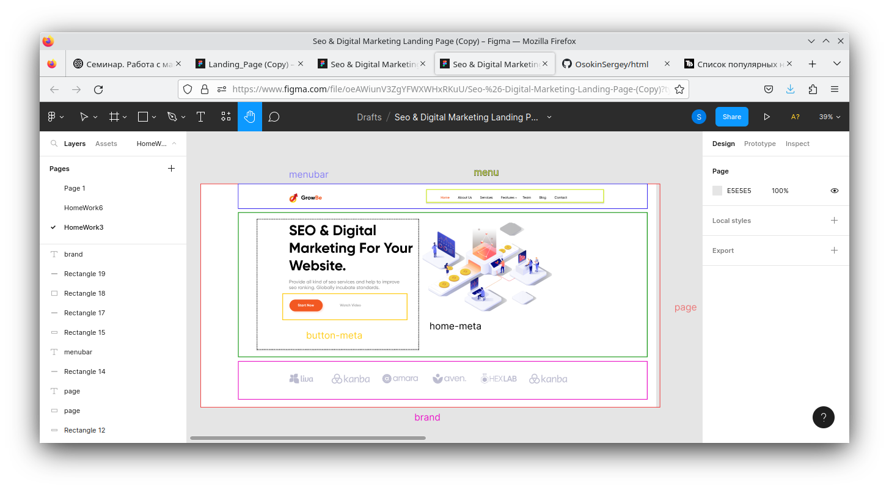

# Веб-вёрстка HTML/CSS

## Урок 6. Семинар. Работа с макетом и cоздание блочной структуры

**Задание**

1. Открыть макет сайта https://www.figma.com/file/mnLY69cYE5cqWM5w6n5hXx/Seo-%26-Digital-Marketing-Landing-Page?node-id=23%3A2
2. Необходимо представить разбиение часть на блоки 
3. Создать новую папку.
4. Создать файл index.html.
5. Добавить все блоки по сайту
6. Добавить все наполнение блоков (html контент)
7. Добавить все заголовки, параграфы кнопки и изображения
8. Создать файл стилей style.css:
- Подключить стили к index.html;
- Добавить обнуление стилей.
- Добавить все необходимые отступы margin, padding.

**Решение**

1. Разбиение на блоки в Figma

